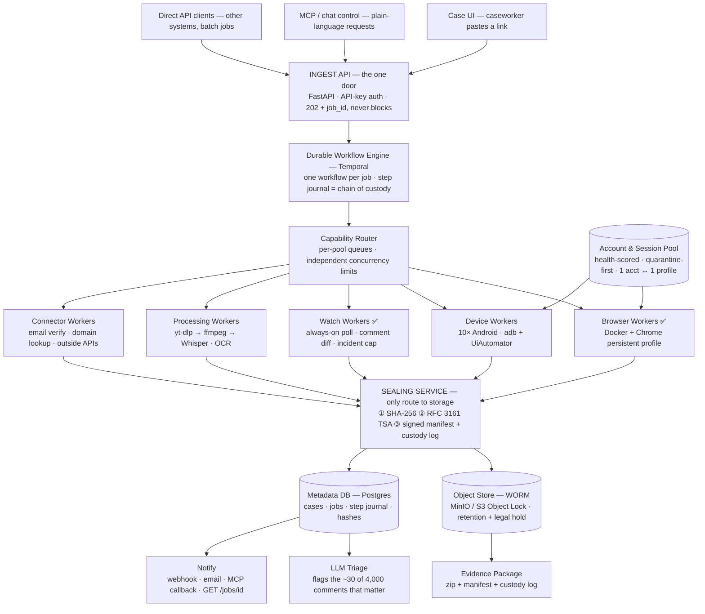

# Evidence Capture Architecture (target)

> Source of truth: `evidence-capture-architecture.tldr`. This document is the version-controlled
> transcription of that board plus the build plan derived from it. `docs/architecture.md` still
> describes the **current** local CLI; this describes where it is going.

## One line

**One door in, one sealed package out.** A unified evidence-capture platform where the capture layer
is pluggable — phones, browsers, and CLIs all sit behind the same worker contract — and nothing reaches
storage unsealed. The output is a legally defensible evidence package, not a scrape.

## Flow

## Status legend (from the board)

- 🟢 **BUILT — running today:** Browser Workers, Watch Workers
- 🟡 **ADAPT — exists, needs porting:** current fb/ig capture code, ffmpeg recording (→ Processing), connector stubs
- 🔵 **NEW — to build:** Ingest API, Temporal, Capability Router, Account & Session Pool, Device Workers,
  Sealing Service, Object Store, Metadata DB, Evidence Package, LLM Triage, Notify

## Components

| Component | Status | What it is |
|---|---|---|
| **Entry points** | 🔵 | Case UI (paste a link), MCP/chat control, Direct API clients — all hit one door. |
| **Ingest API** | 🔵 | FastAPI. API-key auth, validates, opens a case record, returns `202 + job_id` immediately, never blocks. Routes: `/fb/profile · /fb/post · /fb/reel · /ig/profile · /ig/post · /tiktok/profile · /tiktok/post` and `/enrich/*`. |
| **Durable Workflow Engine** | 🔵 | Temporal. One workflow per job; writes each step before doing it, ticks it off after; crash at step 6 resumes at step 6. The execution journal **is** the chain of custody — machine-generated, not written up afterward. |
| **Capability Router** | 🔵 | Per-pool queues with independent concurrency limits so heavy video jobs cannot starve capture devices. |
| **Account & Session Pool** | 🔵 | Health-scored pooled resource. Quarantine on first warning rather than run-until-banned. 1 account ↔ 1 profile/device, never swapped. Attrition is an operating cost, not a bug. |
| **Browser Workers** | 🟢 | Docker + Chrome persistent profile, 1 account ↔ 1 profile volume, fb/ig profile + post-engagement, noVNC login once per worker. 5 running today. |
| **Device Workers** | 🔵 | 10× Android, adb + UiAutomator, real IG/FB apps — app-only content and the view a real user actually sees. Add only where browser fails. |
| **Watch Workers** | 🟢 | Always-on poll, comment diff, incident cap (50 events / 120s gap / 600s). Fires an event the moment a new comment appears — this is what beats the delete button. |
| **Processing Workers** | 🟡 | yt-dlp → ffmpeg → Whisper, OCR on frames. Reel/video download, transcription, searchable text. Separate pool, own limit. |
| **Connector Workers** | 🟡 | Thin wrappers on outside APIs (email verify, domain lookup, whatever you already pay for). Where tool sprawl gets absorbed. |
| **Sealing Service** | 🔵 | The **only** route to storage; nothing is stored unsealed. ① SHA-256 of every artifact ② RFC 3161 trusted timestamp (eIDAS-qualified TSA for EU proceedings) ③ signed manifest + custody log. The line between "a screenshot of what I saw" and "this existed at 14:32 and has not been touched since." |
| **Object Store (WORM)** | 🔵 | MinIO / S3 with Object Lock — write-once. Per-case retention schedule + legal-hold flag. Indefinite retention of personal data is not GDPR-defensible; decide before launch. |
| **Metadata DB** | 🔵 | Postgres. Cases, jobs, step journal, entities, content items, media assets, hashes — the queryable index over sealed evidence. |
| **Evidence Package** | 🔵 | zip + manifest + custody log, ready to attach to a filing. Still valid after every one of those accounts is deleted. |
| **LLM Triage** | 🔵 | Flags which of ~4,000 comments plausibly cross the legal threshold, so review time goes to the ~30 that matter — the throughput edge existing legal tools lack. |
| **Notify** | 🔵 | webhook · email · MCP callback ("job done, 63 captures sealed"); `GET /jobs/{id}` any time. |

## Out of scope (stated up front)

The system **does not identify anyone**. Capture yields a handle: `@username`. Going from handle to human
requires a legal disclosure route (court order / statutory information claim against the platform). The
system builds the evidence package that *supports* that request — it does not unmask. Stated up front so
expectations and platform-ToS exposure stay aligned.

## Where the current codebase fits

The existing `facebook-scraper/` repo is the two 🟢 boxes and their seams — nothing above the worker line exists yet.

| Diagram box | Current code | Status |
|---|---|---|
| Browser Workers | `src/facebook/`, `src/instagram/` scrapers; `docker/` + noVNC | 🟢 (gaps: #29 fb-profile, #30 ig-20posts) |
| Watch Workers | `src/watch/` (poller, incident, comment-diff) | 🟢 (gap: #31 ig-parity) |
| "same worker contract" | `src/registry.ts` plugin/target contract | 🟢 the integration seam the Router will reuse |
| Processing Workers | `src/common/screen-recording.ts` (ffmpeg) | 🟡 seed only |
| tiktok capture | — | 🔵 #32 |
| Everything above the workers | — | 🔵 no code today |

## Stack note — deliberately polyglot

The control plane on the board is **Python** (FastAPI · Temporal · Postgres · MinIO · Whisper). The capture
code is **Node/TypeScript + Playwright**. This is intentional: the TS scrapers are **not** rewritten — they
become the *Browser Workers* pool behind the router's worker contract. `src/registry.ts` is why the router
can treat browser / device / CLI capture uniformly. The seam between the two languages is the worker
contract (a job spec in, a set of raw artifacts + a step journal out), consumed by the Sealing Service.

## Build plan (derived)

Sequenced so the thing that makes it *evidence* comes before the thing that makes it *convenient*.

- **Phase 0 — Close the capture matrix (in flight).** Issues #29 (fb profile), #30 (ig 20-posts),
  #31 (ig watch parity), #32 (tiktok). Valuable regardless of the platform above; keeps the 🟢 boxes complete.
- **Phase 1 — Custody spine (build first).** Metadata DB (Postgres) → Sealing Service (SHA-256 + RFC 3161
  TSA + signed manifest) → Object Store (WORM). Route existing capture output *through* sealing. Without
  this, nothing captured is evidence.
  - **Metadata DB (#33) — implemented** in [`platform/metadata-db/`](../platform/metadata-db/).
    Stack decision (recorded per issue #33): **Python 3.11+ · SQLAlchemy 2.0 · Postgres 17**, matching
    the board's Python control plane. SQL migrations are the authoritative schema; the ORM mirrors them.
    Custody-log integrity (append-only `job_steps`, 1:1 hashes) is enforced by DB triggers/constraints and
    covered by tests against a real Postgres.
  - **Sealing Service (#34) — implemented** in [`platform/sealing/`](../platform/sealing/).
    SHA-256 → RFC 3161 timestamp → Ed25519-signed manifest + custody log; the only caller of the storage
    backend. Packages verify **offline** with just the public key; tampering an artifact or the manifest
    fails verification. ⚠️ The dev timestamper is **not** an eIDAS-qualified TSA — a real RFC 3161 TSA must
    be plugged in before production (`Rfc3161HttpTimestamper`), gated with the WORM/GDPR launch (#35).
  - **Object Store (#35) — implemented** as `sealing.s3_storage.S3WormBackend` (S3/MinIO **Object Lock**,
    versioned bucket + COMPLIANCE DefaultRetention + legal hold; a locked version can't be deleted or
    overwritten). `LocalWormBackend` remains for offline dev. Verified against real MinIO. Per-case
    retention wiring from Sealing and the **GDPR retention policy** are the remaining launch decisions
    (see [`platform/object-store/README.md`](../platform/object-store/README.md)).

### Encapsulating the existing codebase

The Node/TS scraper is now a **capture worker** behind a single seam — the **capture bundle** (see
[`docs/worker-contract.md`](./worker-contract.md)). A worker only produces artifacts for a job; the control
plane does hashing/timestamping/custody/storage. `sealing/capture_import.py` maps the scraper's existing
`out/` artifacts straight into a bundle with **no scraper changes**, turning the standalone CLI into the
Browser-Workers pool. As later phases land, only the *caller* of that seam changes (Router → Temporal),
not the boundary — which is how the whole codebase moves inside the architecture incrementally.
- **Phase 2 — The one door + durability.** Ingest API (FastAPI, 202 + job_id) + Temporal (workflow per job,
  step journal) + Capability Router (per-pool queues). Make the Node capture workers callable behind the contract.
  - **Ingest API (#36) — implemented** in [`platform/ingest-api/`](../platform/ingest-api/). FastAPI, API-key
    auth (fail-closed), capture routes (`/fb/*`, `/ig/*`, `/tiktok/*`) + enrich (`/enrich/*`) + `GET /jobs/{id}`.
    Opens a case + job via the metadata `Repository` and returns `202 + job_id` without blocking; dispatch to
    Temporal (#37) plugs into `routes.py::_accept` without changing the contract. 9 tests pass.
  - **Temporal workflow engine (#37) — implemented** in [`platform/workflow-engine/`](../platform/workflow-engine/).
    `CaptureWorkflow` runs one workflow per job (launch → capture → seal); each step is journaled to the custody
    log before/after, and the terminal step routes artifacts through the real Sealing service. Verified
    end-to-end against an ephemeral local Temporal server + real Postgres (custody log journaled in order, job
    sealed). `client.start_capture_workflow` is the hook the Ingest API calls to enqueue a job.
  - **Capability Router (#38) — implemented** in [`platform/capability-router/`](../platform/capability-router/).
    Routes each job to a worker pool (browser/device/watch/processing/connector), each an independent Temporal
    task queue with its own concurrency limit; dispatch (`start_capture_workflow`) and `worker.py <pool>` use it.
    A test proves the guarantee: a saturated Processing pool does not starve Browser. **Phase 2 complete.**
- **Phase 3 — Account & Session Pool.** Health-scoring + quarantine over the existing per-worker profiles.
  - **Account & Session Pool (#43) — implemented** in [`platform/session-pool/`](../platform/session-pool/).
    Health-scored accounts with atomic leasing (`FOR UPDATE SKIP LOCKED` → concurrent workers get distinct
    accounts), 1↔1 account/profile binding (`UNIQUE(platform, profile_ref)`), quarantine-on-first-warning, and
    raised exhaustion. Verified against real Postgres incl. a two-session concurrent-lease test. 8 tests pass.
- **Phase 4 — Expand capture surface.** Device Workers (Android), Processing Workers (yt-dlp/ffmpeg/Whisper/OCR),
  Connector Workers.
  - **Connector Workers (#39) — implemented** in [`platform/connectors/`](../platform/connectors/). Pluggable
    connector framework (`email-verify`, `domain`) behind `/enrich/*`; external access injected (offline-
    testable); results sealed into the evidence record via `seal_connector_result`. 8 tests pass.
  - **Processing Workers (#45) — implemented** in [`platform/processing/`](../platform/processing/). Pipeline
    `download → ffmpeg (probe + frames) → OCR + transcript`; ffmpeg/ffprobe/tesseract exercised for real,
    Whisper behind a `Transcriber` interface (NullTranscriber default, model not shipped). Derived artifacts
    (transcript/OCR/frames) sealed into DB + WORM. 6 tests pass.
  - Device Workers (#44) remain — needs Android/adb/UiAutomator (hardware), so it'll be built against the same
    bundle contract with the device steps behind an interface.
- **Phase 5 — Outputs & intelligence.** Evidence Package builder, LLM Triage, Notify.
  - **Evidence Package (#40) — implemented** in [`platform/evidence-package/`](../platform/evidence-package/).
    `build_package` composes the Metadata DB + WORM + sealing into a self-contained zip (signed manifest with
    per-artifact SHA-256 + RFC 3161 token, custody log, artifact bytes). `verify_package_zip` verifies it
    **offline** — a test proves it still verifies after the DB and WORM store are deleted. 4 tests pass.
  - **LLM Triage (#41) — implemented** in [`platform/triage/`](../platform/triage/). Scores captured content
    `0..1` for how plausibly it crosses the legal threshold and writes `triage_flags` (derived metadata — it
    never touches sealed artifacts). Real classifier = **claude-opus-4-8** via the Anthropic SDK (structured
    output: score + rationale, prioritization-only, human-in-the-loop); `FakeClassifier` keeps tests offline.
    4 tests pass. Remaining P5: #42 Notify.

Issues #29–32 are the whole of Phase 0 and the bottom-left corner of the board; the phases above them are net-new.
